# PHP File Manager

[](https://opensource.org/licenses/MIT)
[](https://php.net)
[](https://bulma.io)

A modern, secure, and feature-rich PHP file manager with beautiful Bulma UI. Built for standalone use or seamless integration with frameworks like CodeIgniter 4.

> 🤖 **Built with [Antigravity](https://antigravity.google/)** - This project was developed using AI-assisted coding.

---

## 🛡️ Reporting Issues & Security Vulnerabilities

> [!CAUTION]
> **Found a security vulnerability?** Please **do NOT** open a public issue. Instead, report it privately via [GitHub Security Advisories](https://github.com/LifeIsHex/php-file-manager/security/advisories/new) so it can be addressed before public disclosure.

For **bugs** and **feature requests**, please open an issue on GitHub:

- 🐛 [Report a Bug](https://github.com/LifeIsHex/php-file-manager/issues/new?labels=bug&template=bug_report.md)
- 💡 [Request a Feature](https://github.com/LifeIsHex/php-file-manager/issues/new?labels=enhancement&template=feature_request.md)
- ❓ [Ask a Question](https://github.com/LifeIsHex/php-file-manager/issues/new?labels=question)

## ✨ Features

### File Operations
- 📁 **Browse & Navigate** - Intuitive directory browsing with breadcrumb navigation
- ⬆️ **Upload Files** - Drag-and-drop file uploads with progress indicators
- 📥 **Download** - Single file or multi-file download as ZIP
- ✏️ **Rename** - Quick inline renaming
- 🗑️ **Delete** - Single or bulk delete with confirmation modal
- 📋 **Copy & Paste** - Clipboard operations with cut/copy/paste
- 📦 **Compress** - Create ZIP archives from selected files

### Multi-Select Operations
- ☑️ **Checkbox Selection** - Select multiple files with checkboxes
- 🎯 **Select All** - Quick select/deselect all items
- 🔧 **Bulk Actions** - Cut, copy, delete, download selected files

### Drag & Drop
- 🎯 **Drag to Move** - Drag files/folders into other folders
- 🎨 **Visual Feedback** - Drop targets highlight during drag
- 📦 **Multi-Drag** - Select multiple items and drag them together
- ✅ **Confirmation Modal** - Preview move operation before confirming

### Preview & View
- 🖼️ **Image Preview** - View images with dimensions
- 📄 **Text/Code View** - Syntax-highlighted code preview
- 📑 **PDF Viewer** - Inline PDF viewing
- 🍎 **HEIC Support** - Apple HEIC/HEIF image preview and dimensions

### Security
- 🔐 **Authentication** - Built-in login with password hashing
- 🛡️ **CSRF Protection** - Token-based form protection
- 📂 **Path Validation** - Prevents directory traversal attacks
- ⚙️ **Configurable Auth Bypass** - Optional for framework integration

### Modern UI
- 🎨 **Bulma CSS** - Clean, responsive design
- 🌙 **Context Menu** - Right-click actions
- 🔔 **Toast Notifications** - Non-intrusive feedback
- 📱 **Responsive** - Works on desktop and mobile

---

## 📸 Screenshots

<p align="center">
  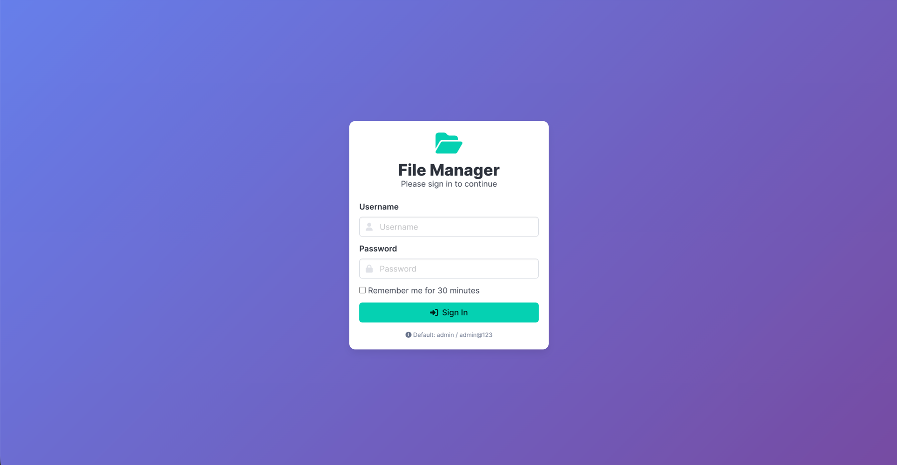
  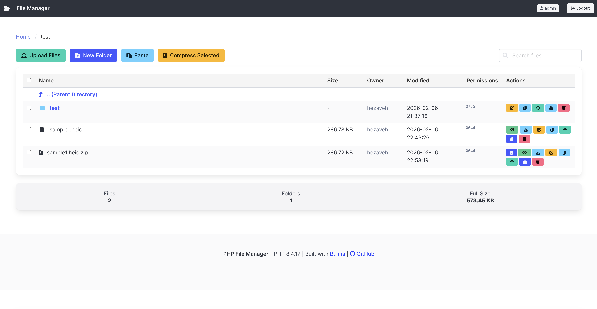
  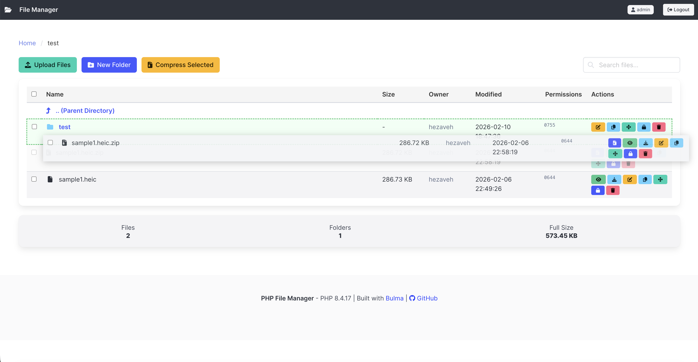
  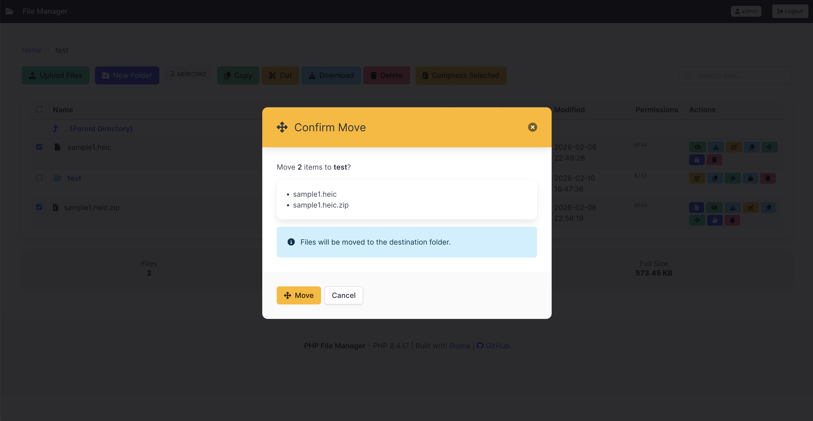
  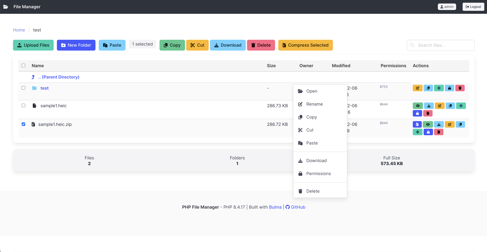
  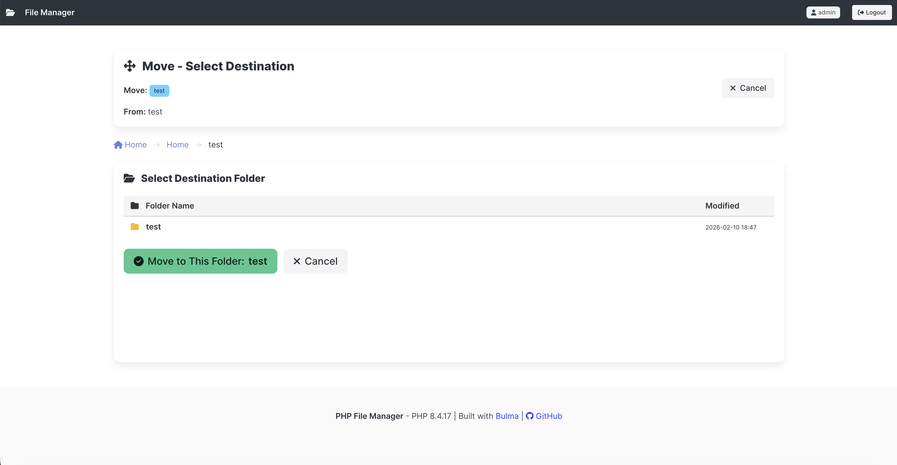
  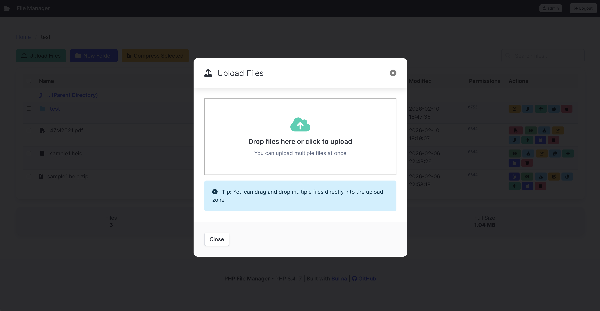
  
  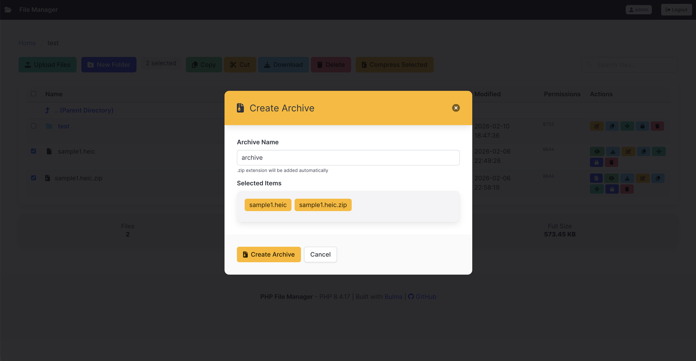
  
  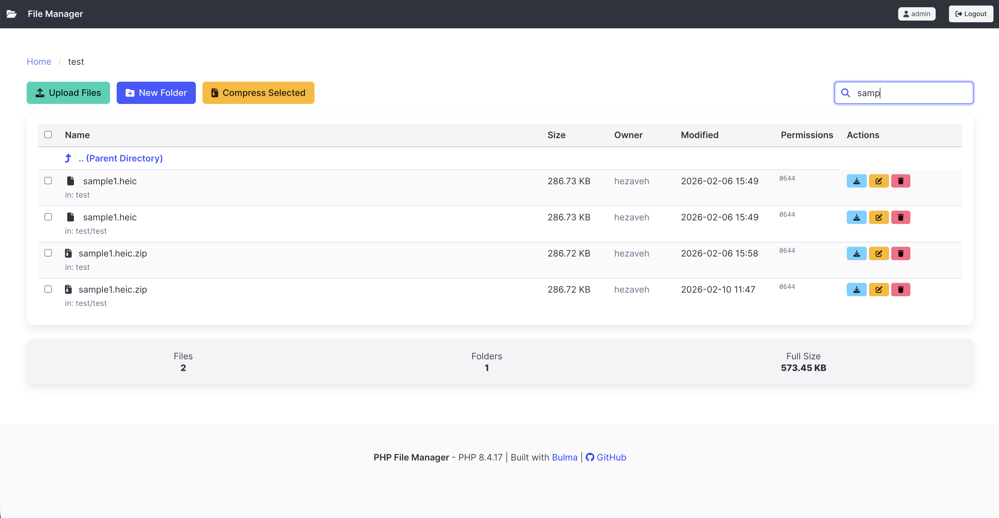
  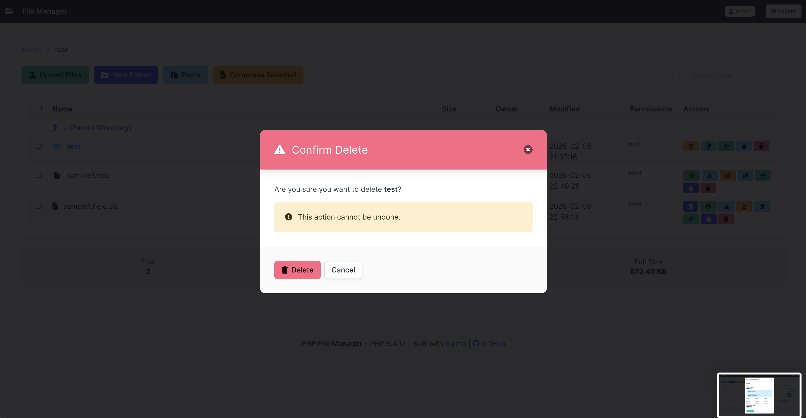
  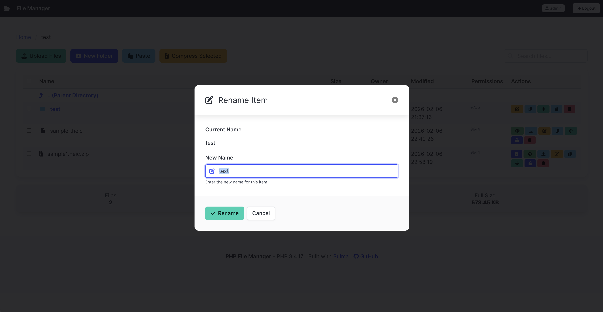
</p>

---

## 🚀 Installation

### Via Composer

```bash
composer require lifeishex/php-file-manager
```

### Manual Installation

1. Clone or download the repository
2. Copy files to your project
3. Configure `config.php`

---

## ⚙️ Configuration

Create or modify `config.php`:

```php
<?php
return [
    'fm' => [
        'root_path' => '/path/to/managed/files',
        'title'     => 'File Manager',
        'language'  => 'en',
        'date_format' => 'Y-m-d H:i',
        'show_hidden' => false,

        // Column visibility — cosmetic only, does NOT restrict operations
        'columns' => [
            'size'        => true,
            'owner'       => true,
            'modified'    => true,
            'permissions' => true,  // Hides the column, NOT the chmod button
        ],
    ],
    'auth' => [
        'require_login' => true,
        'username'      => 'admin',
        'password'      => password_hash('your-password', PASSWORD_DEFAULT),
    ],
    'upload' => [
        'max_file_size'      => 50 * 1024 * 1024,
        'chunk_size'         => 1 * 1024 * 1024,
        'allowed_extensions' => ['*'],
    ],
    'security' => [
        'csrf_enabled' => true,
    ],

    // Role-based access control — controls what users can DO
    'permissions' => [
        'default_role' => 'viewer',
        'roles' => [
            'admin'  => ['*'],
            'editor' => ['upload', 'download', 'delete', 'rename', 'new_folder', 'copy', 'move', 'view', 'view_pdf', 'extract', 'zip'],
            'viewer' => ['view', 'view_pdf', 'download'],
        ],
    ],
];
```

### Column Visibility vs. Permissions — Key Difference

> [!IMPORTANT]
> These are two separate and independent settings. Do not confuse them.

| Setting                  | Purpose            | Effect                                         |
| ------------------------ | ------------------ | ---------------------------------------------- |
| `fm.columns.permissions` | **Display only**   | Hides the permissions column in the file table |
| `permissions.roles`      | **Access control** | Controls which operations a role can perform   |

**Example scenarios:**

- Hide the permissions column but still allow chmod →
  set `columns.permissions = false`, keep `'permissions'` in the role's action list
- Show the permissions column but disallow chmod →
  set `columns.permissions = true`, remove `'permissions'` from the role's action list
- Both hide the column AND disallow chmod →
  set `columns.permissions = false` AND remove `'permissions'` from the role

---


## 🔧 Standalone Usage

```php
<?php
require_once 'vendor/autoload.php';

use FileManager\FileManager;

$config = require 'config.php';
$fileManager = new FileManager($config);
$fileManager->run();
```

---

## 🔌 Framework Integration

### CodeIgniter 4

```php
<?php
// app/Controllers/FileManagerController.php
namespace App\Controllers;

use FileManager\Integration\FileManagerService;

class FileManagerController extends BaseController
{
    public function index()
    {
        $config = [
            'fm' => [
                'root_path' => WRITEPATH . 'uploads',
                'asset_path' => '/filemanager/assets',
            ],
            'auth' => [
                'require_login' => false, // Use CI4's auth
            ],
        ];
        
        $fileManager = new FileManagerService($config);
        return $fileManager->handleRequest();
    }
}
```

### Dynamic Root Path

```php
// Per-user file management
$config['fm']['root_path'] = WRITEPATH . 'uploads/user_' . session()->get('user_id');
```

---

## 📋 Requirements

- **PHP 8.3+**
- **ext-zip** - For multi-file ZIP downloads
- **ext-mbstring** - For proper string handling

### Optional: HEIC Image Support

HEIC/HEIF files (Apple format) can be previewed in the file manager if a suitable conversion tool is available on the server. The file manager detects tools automatically — no configuration needed.

| Platform                  | Tool                  | Install Command                            |
| ------------------------- | --------------------- | ------------------------------------------ |
| **Linux (Ubuntu/Debian)** | ImageMagick + libheif | `sudo apt install imagemagick libheif-dev` |
| **Linux (RHEL/CentOS)**   | ImageMagick + libheif | `sudo dnf install ImageMagick libheif`     |
| **macOS**                 | `sips` (built-in)     | ✅ No install needed                        |
| **macOS** (optional)      | ImageMagick           | `brew install imagemagick`                 |

> **Note:** On Ubuntu, the default `apt install imagemagick` package (ImageMagick 6) may not include HEIC support. If HEIC conversion fails, verify with: `convert -list format | grep HEIF`
> If not listed, install a version compiled with libheif:
> ```bash
> sudo apt install imagemagick libheif-dev
> ```

> **Graceful degradation:** If no HEIC tool is found, the file manager still works normally — HEIC files can still be uploaded, downloaded, renamed, and deleted. Only the inline preview will be unavailable.

---

## 🤝 Contributing

Contributions are welcome! This is an MIT-licensed open-source project.

1. Fork the repository
2. Create your feature branch (`git checkout -b feature/amazing-feature`)
3. Commit your changes (`git commit -m 'Add amazing feature'`)
4. Push to the branch (`git push origin feature/amazing-feature`)
5. Open a Pull Request

---

## 📄 License

This project is licensed under the MIT License - see the [LICENSE](LICENSE) file for details.

---

## 👤 Author

**Mahdi Hezaveh**

- GitHub: [@LifeIsHex](https://github.com/LifeIsHex)

---

## ⭐ Support

If you find this project useful, please consider giving it a ⭐ on GitHub! Your support helps the project grow and motivates continued development.

[](https://github.com/LifeIsHex/php-file-manager)

---
